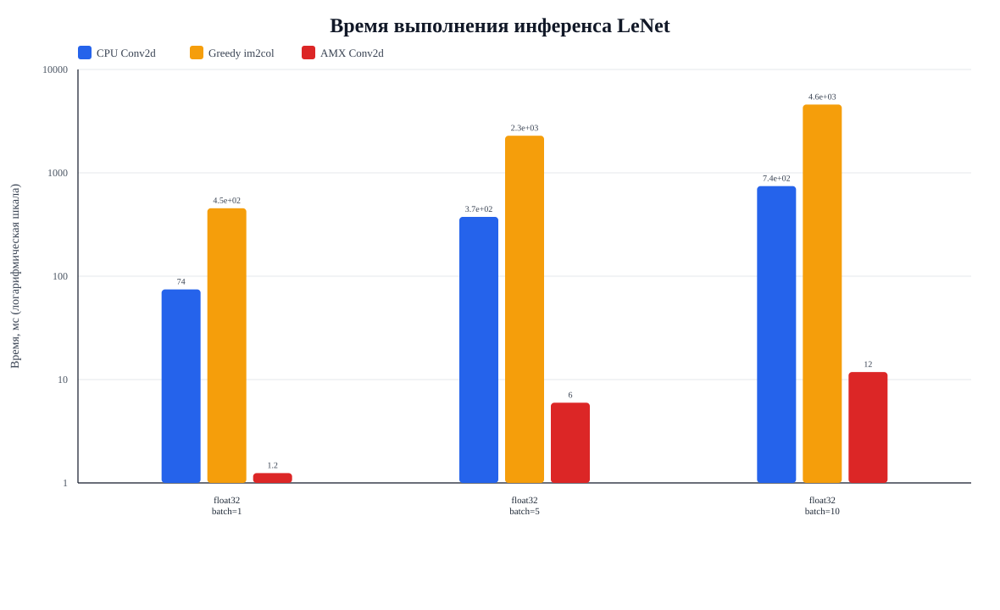
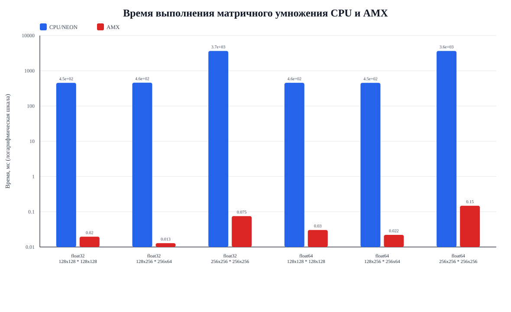

<h1 align="center">Apple Fast Inference</h1>

	
	
	
	

<strong>Apple Fast Inference</strong> -- C++ API-библиотека для высокопроизводительного выполнения прямого прохода
вещественных и квантованных сверточных нейронных сетей на устройствах Apple Silicon.

---

# Команда

| ФИО                          | Роль                    | Группа | GitHub                                      |
|------------------------------|-------------------------|--------|---------------------------------------------|
| Ергучев Александр Дмитриевич | Разработчик             | БПИ241 | [yalpcode](https://github.com/yalpcode)     |
| Суханов Григорий Александрович | Разработчик  | БПИ241 | [gsukhanov](https://github.com/gsukhanov)   |

# Введение

Проект «Быстрая реализация вещественных и квантованных сверточных нейронных сетей на мобильных устройствах Apple»
предназначен для создания высокопроизводительной библиотеки инференса CNN на устройствах с архитектурой Apple Silicon.
В рамках работы сравниваются CPU- и AMX-исполнения, поддерживаются вещественные и квантованные представления различной
разрядности, а целевой архитектурой выступает VGG-уровень для задач компьютерного зрения.

Библиотека предоставляет единый интерфейс для создания тензоров, загрузки весов модели, выполнения операций нейронной
сети и переключения между эталонным CPU-исполнением и ускоренным путем с использованием Apple Matrix Extensions (AMX)
и фреймворка Accelerate.

# Возможности

- управление жизненным циклом тензоров: создание, описание формы, доступ к данным и проверка размерностей;
- базовые операции линейной алгебры, включая матричное умножение (GEMM);
- слои нейронных сетей: `Conv2D`, `Linear`, `ReLU`, `Softmax`, `AvgPool2D`, `Flatten`;
- преобразование свертки в матричное умножение с помощью `im2col`;
- загрузка весов из JSON-файлов, в том числе после конвертации из PyTorch;
- тестирование корректности и бенчмаркинг CPU/AMX-путей исполнения.

# Документация

> [!NOTE]
> Подробные программные документы находятся в папке [docs](docs).

| Документ | PDF |
|----------|-----|
| Техническое задание | [ТЗ.pdf](docs/pdf/ТЗ.pdf) |
| Пояснительная записка | [ПЗ.pdf](docs/pdf/ПЗ.pdf) |
| Программа и методика испытаний | [ПМИ.pdf](docs/pdf/ПМИ.pdf) |
| Руководство оператора | [РО.pdf](docs/pdf/РО.pdf) |
| Текст программы | [Текст Программы.pdf](docs/pdf/Текст%20Программы.pdf) |
| Приложение 6 | [Приложение 6.pdf](docs/pdf/Приложение%206.pdf) |

# Результаты бенчмарков

